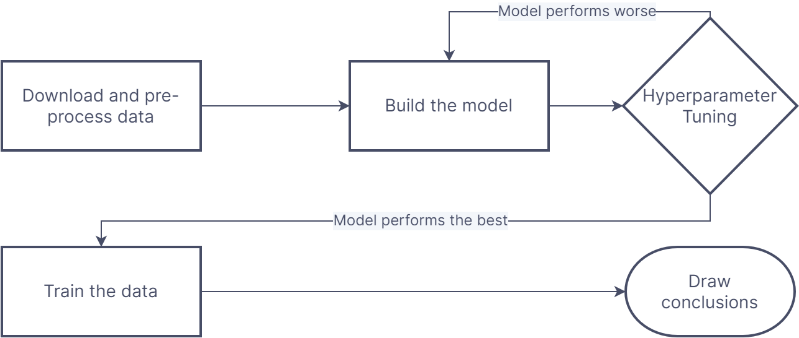

# Obsidian Decision Tree Model
A machine learning model created to identify the various production stages of obsidian tools by analyzing automated measurements taken of experimental midrodebitage.

# Table Of Contents
-  [Libraries](#libraries)
-  [Background](#background)
-  [Problem to solve](#problem-to-solve)
-  [Data](#data)
-  [Procedure](#procedure)
-  [Finding the best model and hyperparameters](#finding-the-best-model-and-hyperparameters)
-  [Outcomes](#outcomes)
-  [Future Work](#future-work)
-  [References](#references)

# Libraries
- [pandas](https://pandas.pydata.org/) (Data analysis and manipulation)
- [numpy](https://numpy.org/) (Scientific computing)
- [seaborn](https://seaborn.pydata.org/) (Statistical data visualization)
- [matplotlib](https://matplotlib.org/) (Visualization with Python) 
- [sklearn](https://scikit-learn.org) (Machine learning with Python)

# Background
Understanding how stone tools were made is essential for interpreting the social, economic, and political processes of ancient societies. Because the tools themselves are often transported from the places they were made, archaeologists must analyze the debitage, or leftover stone pieces, that are knocked off when making a stone tool. The smallest of these artifacts, microdebitage, measures < 6mm and tends to be less vulnerable to post-depositional movement from human activities (such as cleaning and sweeping) and natural processes (such as bioturbation and erosion). Because of this, archaeologists can study the spatial organization of microdebitage to better understand where stone tools were being made at archaeological sites.

Eberl, M., Johnson, P. , & Estrada Aguila, R. (2022). Studying lithic microdebitage with a dynamic image particle analyzer. North American Archaeologist, 1-16. DOI: 10.1177/01976931221109301 

# Problem to solve
Manually analyzing microdebitage is a time and labor intensive process. Archeologists must collect soil samples, seperate them into size fractions and then manually analyze them under a microscope to identify microdebitage. This process takes over 10 hours per soil sample and is strenuous on the eyes. The goal, is to create a machine learning model that will classify microdebitage into certain stages of tool production.

# Data
All the data used was provided by Vanderbilt University.

The training data was produced in a controlled environment where we had a knapper create tools in a room covered by tarp. Two different rocks were used: chert and obsidian. For each stage of production, the microdebitage was collected, analyzed and put into a dataset. Contains over 180,000 rows of data.

# Procedure

# Pre-processing
We started by removing columns of data that were either the same value across the board or had no relevance to our target.

Unfortunately, we also had to remove columns that were not present across all the datasets. Unfortunately, this data was found to be crucial for distinguishing both the rock type and production stage.

# Finding the best model and hyperparameters
In seeking the best model for our objective, we had every person in the group try a different model using the same training dataset and compared our results.

List of models we tried:
1. Kmeans
2. Decision Trees
3. Random Forest
4. Tensorflow Classifier Model
5. Gradient Descent
6. KNearestNeighbors

Out of all the models we tried, Decision Tree seemed to provide the best result given the obsidian training data.

To find the best hyperparamaters, we started by manually tuning our models' hyperparameters and ultimately ran a gridsearch overnight which gave us the best hyperparameters to use.

We used accuracy as the metric to determine which model worked best as we were looking for overall correctness.

# Outcomes
After training the model and making predictions, we found this model to have the an accuracy of ~.60 or ~60%.

# Future Work
- Acquiring the data for the three crucial missing columns by re-running those experiments and get those features. This would also allow us to create one model that can determine whether it's obsidian or chert in addition to determining it's production stages.

- Vanderbilt University created a model that seperates the soil with microdebitage. Combining that model with the obsidian and chert model would make the program better and easier to use.

# References
https://towardsdatascience.com/how-to-tune-a-decision-tree-f03721801680 
https://scikit-learn.org/stable/ 
https://www.xoriant.com/blog/decision-trees-for-classification-a-machine-learning-algorithm
https://scikit-learn.org/stable/modules/generated/sklearn.tree.DecisionTreeClassifier.html
https://scikit-learn.org/stable/modules/generated/sklearn.model_selection.train_test_split.html

Eberl, M., Johnson, P. , & Estrada Aguila, R. (2022). Studying lithic microdebitage with a dynamic image particle analyzer. North American Archaeologist, 1-16. DOI: 10.1177/01976931221109301 

Unpublished articles provided by Dr. Phyllis Johnson
