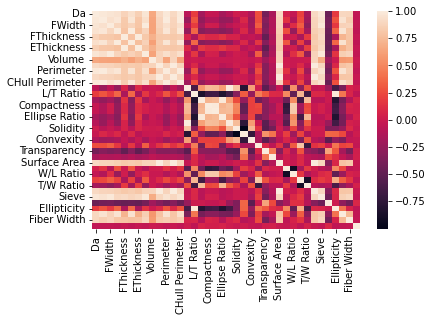

[](https://classroom.github.com/online_ide?assignment_repo_id=8127865&assignment_repo_type=AssignmentRepo)
<!--
Name of your teams' final project
-->
# final-project
## [National Action Council for Minorities in Engineering(NACME)](https://www.nacme.org) Google Applied Machine Learning Intensive (AMLI) at the University Of Kentucky


<!--
List all of the members who developed the project and
link to each members respective GitHub profile
-->
Developed by: 
- [Kimi Medina-Castellano](https://github.com/kimimedina) - `University of Kentucky`
- [Rodrigo Aguilar Barrios](https://github.com/Rodrigox30) - `University of California, Berkeley` 
- [Luke Taylor](https://github.com/LukeTaylor1) - `University of Kentucky` 
- [Jose Cruz](https://github.com/Resoj) - `University of Kentucky`

## Objective
To determine the production stages of ancient stone tools using automated measurements taken of experimental microdebitage.

## Goals
To create a model that will accurately determine the production stage that an ancient stone tool was undergoing based off the features of the microdebitage left behind.

## The Dataset
We received data for two different stone tools in the form of Excel files via Box (file sharing platform). The Excel files contain features about the physical properties of the microdebitage and each file contains data for each stage of the tool. In preparing the data, we removed features that were the exact same value across all the datasets – values that would make no difference – and removed features that immediately seemed irrelevant to our objective.

## Description
The quoted paragraphs below are taken directly from the proposal presented to us by our mentors. 
> "Understanding how stone tools were made and used is essential for interpreting the social, economic, and political processes of ancient societies. Stone is also the most durable of all materials used by Pre-Columbian societies in North America and is therefore one of the most common heritage artifact types recovered from archaeological sites. Because the tools themselves are often transported from the places they were made, archaeologists must analyze the debitage, or leftover stone pieces, that are knocked off when making a stone tool. The smallest of these artifacts, microdebitage, measures < 6mm and tends to be less vulnerable to post-depositional movement from human activities, such as cleaning and sweeping, and natural processes, such as bioturbation and erosion. Because of this, archaeologists can study the spatial organization of microdebitage to better understand where stone tools were being made at archaeological sites. However, the study of microdebitage is hindered by tedious and time-consuming methods. For example, an experienced analyst will invest up to 10 hours to separate microdebitage from an archaeological soil matrix sample, following water-screening or flotation and then manual inspection through microscopy. Recently, a novel method using automated dynamic image analysis was implemented to quantify shape variables of microdebitage and differentiate it from natural particles in archaeological soil samples in a fraction of the time (Johnson et al., 2021), paving the way for efficient analysis of microdebitage to address a range of heritage science research questions.

> This Google-NACME AMLI summer project envisions the application of machine learning techniques to automated measurements taken of experimental microdebitage, in order to test whether different stone tool production stages can be classified."

## Our approach to solving this problem

We first start by downloading the microdebitage data that was collected from a control experiment and placing it in dataframes to analyze. 

```
exp_1 = pd.read_excel("EXP-00001-Master.xlsx")
exp_2 = pd.read_excel('EXP-00002-Master.xlsx')
exp_3 = pd.read_excel('EXP-00003-Master.xlsx')
exp_4 = pd.read_excel('EXP-00004-Master.xlsx')
exp_5 = pd.read_excel('EXP-00005-Master.xlsx')
```

Then, we clean the data by removing irrelevant columns of data, which are named below.
```
not_included = ['Id', 'Filter0','Filter1', 'Filter2','Filter3', 'Filter4', 'Filter5', 'Filter6', 'hash', 'Img Id', 'Curvature', 'Transparency', 'Angularity']
```
We will not include these columns of data because it did not have relevant data (same value for all in the column) or it was used to identify the row (Id and Img Id)

The columns of Transparency, Curvature and Angularity were removed since there was no data for those columns for the chert dataset. We decided to remove those because they were crucial towards our models prediction. Rather than replacing it with other values, it was best to just remove it.

Then we added production stage of where each dataframe target was.
```
exp_1_filtered['Production Stage'] = 0
exp_2_filtered['Production Stage'] = 1
exp_3_filtered['Production Stage'] = 2
exp_4_filtered['Production Stage'] = 3
exp_5_filtered['Production Stage'] = 4
```
The description of the target columns is:
* 0 - Chert Stone tool at it's first production stage
* 1 - Chert stone tool at it's second production stage
* 2 - Chert stone tool at it's third production stage
* 3 - Obsidan tool at it's first production stage
* 4 - Obsidian tool at it's second production stage 

We then proceded to do a heatmap to visualize the data.



The column that we were looking at was the last column/the last row to determine if there were strong correlations with other data  to our target. We determine that there were no such correlations, which meant that we would not get results that we would want. 

Due to there being no correlation, there was no machine learning algorithm that we thought would best fit this problem so we decided to use the following models:
* Decision Trees
* KNeighborsClassifier
* Tensorflow Model

## Team Workflow
Each group member tried a different approach to develop an effective model. Below are links to each member's READ.ME file that details and explains their linear path for this project. [Link](https://github.com/Applied-Machine-Learning-2022/final-project-the-rock-group-uk/blob/main/July%2028%20-%20Classifying%20Microdebitage%20-%20Final%20Project.pdf) to slides from group presentation
* [Kimi](https://github.com/Applied-Machine-Learning-2022/final-project-the-rock-group-uk/blob/bbd838bf069fd07990fa04373e4fc64074db671d/README-DecisionTrees_RandomForest.md): [Merging Data](https://github.com/Applied-Machine-Learning-2022/final-project-the-rock-group-uk/blob/ad4689c6836f959d342926b97656cd3bbcaa5966/Kimi_Final_Project_AllData.ipynb), [Decision Tree / Random Forest (All Data)](https://github.com/Applied-Machine-Learning-2022/final-project-the-rock-group-uk/blob/09c670e26a88696ed198b198747a1fe082c86c1d/Decision_Tree_Random_Forest_FinalProject.ipynb), [Chert Decision Tree](https://github.com/Applied-Machine-Learning-2022/final-project-the-rock-group-uk/blob/491a5fb447ce8486959d6766b72b051aacb202d7/Chert_Model__Decision_Trees.ipynb)
* Rodrigo [TensorFlow](https://github.com/Applied-Machine-Learning-2022/final-project-the-rock-group-uk/blob/main/README-KNeighborsClassifier.md) [KNeighborsClassifier](https://github.com/Applied-Machine-Learning-2022/final-project-the-rock-group-uk/blob/main/README-KNeighborsClassifier.md)
* Luke: [KNeighborsClassifier (two models)](https://github.com/Applied-Machine-Learning-2022/final-project-the-rock-group-uk/blob/main/LukeReadMe.md)
* Jose:[Decision Tree](https://github.com/Applied-Machine-Learning-2022/final-project-the-rock-group-uk/blob/main/Obsidian%20Decision%20Tree%20Model.md)
