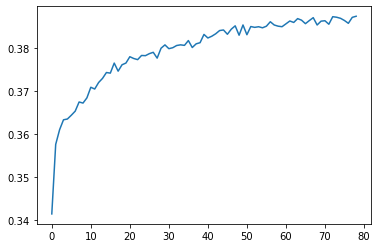

[](https://classroom.github.com/online_ide?assignment_repo_id=8127865&assignment_repo_type=AssignmentRepo)
<!--
Name of your teams' final project
-->
# final-project
## [National Action Council for Minorities in Engineering(NACME)](https://www.nacme.org) Google Applied Machine Learning Intensive (AMLI) at the University Of Kentucky

<!--
List all of the members who developed the project and
link to each members respective GitHub profile
-->
Developed by: 
- [Kimi Medina-Castellano](https://github.com/kimimedina) - `University of Kentucky`
- [Rodrigo Aguilar Barrios](https://github.com/Rodrigox30) - `University of California, Berkeley` 
- [Luke Taylor](https://github.com/LukeTaylor1) - `University of Kentucky` 
- [Jose Cruz](https://github.com/Resoj) - `University of Kentucky`

## Objective
To determine the production stages of ancient stone tools using automated measurements taken of experimental microdebitage.

## Goals
To create a model that will accurately determine the production stage that an ancient stone tool was undergoing based off the features of the microdebitage left behind.

## The Dataset
We received data for two different stone tools in the form of Excel files via Box (file sharing platform). The Excel files contain features about the physical properties of the microdebitage and each file contains data for each stage of the tool. In preparing the data, we removed features that were the exact same value across all the datasets – values that would make no difference – and removed features that immediately seemed irrelevant to our objective.

## Description
<!--
Problem: Archeologists 
-->

## Team Workflow
Each group member tried a different approach to develop an effective model. Below are links to each member's READ.ME file that details and explains their linear path for this project. 
* Kimi
* Rodrigo
* Luke
* Jose

## Usage instructions
<!--
Give details on how to install fork and install your project. You can get all of the python dependencies for your project by typing `pip3 freeze requirements.txt` on the system that runs your project. Add the generated `requirements.txt` to this repo.
-->
Due to a problem in the data collection of the microdebitage, we did not have an optimal model that would work to fit this problem. We will explain how this model will work once we get the optimal data that we think is needed to obtain better accuracy. After the tensorflow model, we will provide what we think was the best way to go about solving this problem by providing two different seperate problems solved by other models.
### **Tensorflow model**
We will first download the necessary libraries
```
import pandas as pd
import tensorflow as tf
```
We will convert the data into dataframes. Note that **EXP-00001, EXP-00002 and EXP-00003** refers to the data of the microdebitage at the production stage of the chert tool  while **EXP-00004 and EXP-00005** are the stages of the obsidian tool.
```
exp_1 = pd.read_excel("EXP-00001-Master.xlsx")
exp_2 = pd.read_excel('EXP-00002-Master.xlsx')
exp_3 = pd.read_excel('EXP-00003-Master.xlsx')
exp_4 = pd.read_excel('EXP-00004-Master.xlsx')
exp_5 = pd.read_excel('EXP-00005-Master.xlsx')
```
Due to an error caused by Excel, we will delete the second row with the following code
```
exp_1.drop(index=0, inplace=True)
exp_2.drop(index=0, inplace=True)
exp_3.drop(index=0, inplace=True)
exp_4.drop(index = 0, inplace = True)
exp_5.drop(index = 0, inplace= True)

exp_1.reset_index(drop=True, inplace=True)
exp_2.reset_index(drop=True, inplace=True)
exp_3.reset_index(drop=True, inplace=True)
exp_4.reset_index(drop=True, inplace=True)
exp_5.reset_index(drop=True, inplace=True)
```
Since we found some data to not have any impact on our model accuracy, we decided to take it out of our dataframes. We included Curvature, Transparency, Angularity in the columns to be removed because it was missing in the chert data. We decided it was better to remove this because we did not want to make up data. We also added the production stage such that stage 0 was the first stage of chert, stage 1 was for the second stage of chert, stage 2 was for the third stage of chert, stage 3 is the first stage of the obsidian tool and stage 4 was the second stage of the obsidian tool.
```
not_included = ['Id', 'Filter0','Filter1', 'Filter2','Filter3', 'Filter4', 'Filter5', 'Filter6', 'hash', 'Img Id', 'Curvature', 'Transparency', 'Angularity']

filtered = [x for x in exp_1.columns if x not in not_included]

exp_1_filtered = exp_1[filtered]
exp_2_filtered = exp_2[filtered]
exp_3_filtered = exp_3[filtered]
exp_4_filtered = exp_4[filtered]
exp_5_filtered = exp_5[filtered]

exp_1_filtered['Production Stage'] = 0
exp_2_filtered['Production Stage'] = 1
exp_3_filtered['Production Stage'] = 2
exp_4_filtered['Production Stage'] = 3
exp_5_filtered['Production Stage'] = 4
``` 

Then we merged all dataframes into one
```
data = exp_1_filtered.merge(exp_2_filtered, how= 'outer')
data = data.merge(exp_3_filtered, how = 'outer')
data = data.merge(exp_4_filtered, how = 'outer')
data = data.merge(exp_5_filtered, how='outer')
```

We then converted all values in the dataframes to numeric types
```
for x in data.columns: 
    data[x] = pd.to_numeric(data[x])
```
In order to use the Tensorflow, we will need to add 5 additional columns that each will 1 if it's the stage that the column is about or 0 for everything else
```
stage_0 = [1 if x ==0 else 0 for x in data['Production Stage'] ]
stage_1 = [1 if x ==1 else 0 for x in data['Production Stage']]
stage_2 = [1 if x ==2 else 0 for x in data['Production Stage']]
stage_3 = [1 if x ==3 else 0 for x in data['Production Stage']]
stage_4 = [1 if x ==4 else 0 for x in data['Production Stage']]

the_stages = ['stage_0', 'stage_1', 'stage_2', 'stage_3', 'stage_4']

data['stage_0'] = stage_0
data['stage_1'] = stage_1
data['stage_2'] = stage_2
data['stage_3'] = stage_3
data['stage_4'] = stage_4
```

We then made the neural network. We found this method to work well enough. We had 5 outputs because for the model to classify. We shuffled the data such that eighty percent of it is training as training and the other twenty as testing.
```
model = tf.keras.Sequential([
    tf.keras.layers.Dense(len(filtered) * 2, input_shape=(len(filtered),)),
    tf.keras.layers.Dense(16, activation = 'relu'),
    tf.keras.layers.Dense(8, activation = 'relu'),
    tf.keras.layers.Dense(5, activation = tf.nn.softmax)])

model.compile(
    loss='categorical_crossentropy',
    optimizer='Adam',
    metrics=['accuracy'],
)

rows = data.shape[0]
eighty = int(rows * .8)

random = data.sample(frac=1)
train = random[:eighty]
test = random[eighty:]
```
Then, we fitted the model using our data and let it run.
```
callback = tf.keras.callbacks.EarlyStopping(monitor='loss', patience=5)
history = model.fit(
    train[filtered],
    train[the_stages],
    epochs=100,
    callbacks=[callback],
    validation_data = [test[filtered], test[the_stages]]
)
```
And found that our highest accuracy was around 38%.
```
import matplotlib.pyplot as plt
history.history['accuracy']

plt.plot(history.epoch, history.history['accuracy'])
```


### **KNeighbors Classifier**
We originally tried making a single model to classify both chert and obsidian however, the accuracy reading were very low. So our team decided to make two models, one for chert and one for obsidian because the transparency feature was too important to be left out. This section goes over the KNeighbors model. Most of the earlier stages of importing and shaping the data will be skipped because it was mentioned above.

The K neighbors classifier is used for supervised learning, which is what we were given since we know the stages of the tools. The classifier works by classifing nodes based on their distances to the 'neighbors' (similar data points) around them. [Link](https://en.wikipedia.org/wiki/K-nearest_neighbors_algorithm) to wikipedia article for more in depth explaination.

First we import the data from the spread sheet. Three of the datasets are chert and two of them are obsidan and then drop the first row since it just contained the units for all of the data points and weren't numerical values. 

```
# Chert 
exp_1 = pd.read_excel("EXP-00001-Master.xlsx")
exp_2 = pd.read_excel('EXP-00002-Master.xlsx')
exp_3 = pd.read_excel('EXP-00003-Master.xlsx')

# Obsidian 
exp_4 = pd.read_excel('EXP-00004-Master.xlsx')
exp_5 = pd.read_excel('EXP-00005-Master.xlsx')

# dropping first row
exp_1.drop(index=0, inplace=True)
exp_2.drop(index=0, inplace=True)
exp_3.drop(index=0, inplace=True)
exp_4.drop(index = 0, inplace = True)
exp_5.drop(index = 0, inplace= True)

# resetting the index values
exp_1.reset_index(drop=True, inplace=True)
exp_2.reset_index(drop=True, inplace=True)
exp_3.reset_index(drop=True, inplace=True)
exp_4.reset_index(drop=True, inplace=True)
exp_5.reset_index(drop=True, inplace=True)
```

Because we are making a model for both, we made two separate filters to get the respective columns in each dataframe. The filters were pretty much the same except Curvature, Angularity and Transparency were filtered out of the Chert model. After, the filtered datasets were saved into variables

```
# Obsidian 
O_not_included = ['Id', 'Filter0','Filter1', 'Filter2','Filter3', 'Filter4', 'Filter5', 'Filter6', 'hash', 'Img Id']
O_filtered = [x for x in exp_4.columns if x not in O_not_included]

# Chert
C_not_included = ['Id', 'Filter0','Filter1', 'Filter2','Filter3', 'Filter4', 'Filter5', 'Filter6', 'hash', 'Img Id', 'Curvature', 'Transparency', 'Angularity']
C_filtered = [x for x in exp_1.columns if x not in C_not_included]

# Chert Filtered 
exp_1_filtered = exp_1[C_filtered]
exp_2_filtered = exp_2[C_filtered]
exp_3_filtered = exp_3[C_filtered]

# Obsidian filtered
exp_4_filtered = exp_4[O_filtered]
exp_5_filtered = exp_5[O_filtered]
```

Here, we are adding the production stages. Similar to what was done for the Tensor flow model. There are 2 tools, one tool had three distinct stages and the other had two distinct stages which means there are 5 distinct outcomes.
```
# Setting production stage values
# Chert
exp_1_filtered['Production Stage'] = 0
exp_2_filtered['Production Stage'] = 1
exp_3_filtered['Production Stage'] = 2

# Obsidian
exp_4_filtered['Production Stage'] = 3
exp_5_filtered['Production Stage'] = 4
```

Then we made the two data frames. exp_1, exp_2, exp_3 went into the chert data frame and exp_4 and exp_5 went into the obsidian.
```
# Merging Chert Data
C_data = exp_1_filtered.merge(exp_2_filtered, how= 'outer')
C_data = C_data.merge(exp_3_filtered, how = 'outer')

# Merging Obsidian Data
O_data = exp_4_filtered.merge(exp_5_filtered, how = 'outer')
```

In order to get the training and the testing data, we used the scikit learn's test train split, with the stratify on the production stage column. The split is 10% in test, 90% in train.
```
# Obsidian test train split
from sklearn.model_selection import train_test_split

X_train, X_test, y_train, y_test = train_test_split(
    O_data[O_filtered],
    O_data['Production Stage'],
    test_size=0.1,
    stratify= O_data['Production Stage'],
    random_state=44)
```

Since the data contains different scales of data, we had to use the StandardScaler to standardize the data.
```
from sklearn.preprocessing import StandardScaler

sc_X = StandardScaler()
X_train = sc_X.fit_transform(X_train)
X_test= sc_X.transform(X_test)
```

Here is the model for obsidian. The parameters were optimized using a gridsearch that will be explained later. After we ran the model, we computed the accuracy score which was 72%. This was a significant increase when compared with the first K neighbors attempt.
```
# Obsidian Model
from sklearn.neighbors import KNeighborsClassifier
from sklearn.preprocessing import scale
from sklearn.metrics import accuracy_score

O_model = KNeighborsClassifier(n_neighbors=5,
                            weights= 'distance', 
                            p = 1, 
                            leaf_size= 5, 
                            algorithm='auto')
O_model.fit(O_data[O_filtered], O_data["Production Stage"])
labels = O_data['Production Stage']

O_predictions = O_model.predict(X_test)

print('Accuracy score:',accuracy_score(y_test, O_predictions))

# Accuracy score: 0.7260606060606061
```

To find the best parameters for the model, we ran a grid search looking at the weight, algorithm, and leaf size. 
The weight takes into account the distance of the nodes, so uniform means all distances are weighted the same while distance increase the weight the close nodes are to one another.
The algorithm is how the nearest neighbor is calculated. 
links to [ball tree](https://scikit-learn.org/stable/modules/generated/sklearn.neighbors.BallTree.html#sklearn.neighbors.BallTree) and [kd tree](https://scikit-learn.org/stable/modules/generated/sklearn.neighbors.KDTree.html#sklearn.neighbors.KDTree)
auto allows the model to decide which is best for what instance, and brute is the brute force method.
The leaf size is for the ball and kd tree algorithm
```
# Obsidian Grid search
from sklearn.pipeline import Pipeline
from sklearn.model_selection import GridSearchCV

params = [{ 
    'weights' : ['uniform', 'distance'],
    'algorithm': ['auto', 'ball_tree', 'kd_tree', 'brute'],
    'leaf_size': [5,10,15,20,25,30,35,40],
            }]

search = GridSearchCV(O_model, 
                    param_grid = params,
                    scoring = 'accuracy',
                    cv = 5)

search.fit(X_train,y_train)
print(search.best_params_)

# OUTPUT: {'algorithm': 'auto', 'leaf_size': 5, 'weights': 'distance'}
```


The same process was repeated for the chert. As you can see below, the code is pretty much identical besides the changing of the variables. However, the results are drastically worse. The accuracy of the model is around 44% which is almost 30% worse than the obsidian one from above. The shows the importance of the transparancy, curvature and angularity columns
```
# Chirt test train split
from sklearn.model_selection import train_test_split

CX_train, CX_test, cy_train, cy_test = train_test_split(
    C_data[C_filtered],
    C_data['Production Stage'],
    test_size=0.1,
    stratify= C_data['Production Stage'],
    random_state=44)

sc_CX = StandardScaler()
C_train = sc_CX.fit_transform(CX_train)
CX_test= sc_CX.transform(CX_test)

# Chert Model
from sklearn.neighbors import KNeighborsClassifier
from sklearn.preprocessing import scale
from sklearn.metrics import accuracy_score

C_model = KNeighborsClassifier(n_neighbors=5, 
                            weights= 'distance',
                            p = 1, leaf_size= 5, 
                            algorithm='auto')

C_model.fit(C_data[C_filtered], C_data["Production Stage"])
labels = C_data['Production Stage']

random = C_data.sample(frac = 1)

one_hundred = random[:10000]

C_predictions = C_model.predict(CX_test)

print('Accuracy score:',accuracy_score(cy_test, C_predictions))

# Accuracy score: 0.4437566324725858
```
